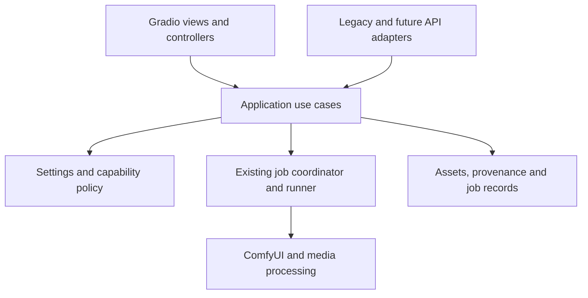

# MiniMax H3: UI/UX redesign and refactor plan

Original review date: 2 October 2026

Revision date: 3 October 2026

Repository: [keboqi/minimax-h3](https://github.com/keboqi/minimax-h3)

Reviewed commit: [e773cd6](https://github.com/keboqi/minimax-h3/tree/e773cd6461004a94251c89865d827d4fefa1caa4)

## 1. Recommendation and scope

Evolve the application into a coherent creative workspace with shared generation, media, job, and model-management experiences. Keep H3 prominent and retain direct access to each engine. Implement the first release in Gradio, building on the existing domain and execution layers. Consider a dedicated TypeScript frontend only after validated product requirements exceed Gradio's practical limits.

The main problem is not a lack of features or a missing backend architecture. It is the distance between a user's creative intent and the controls, dependencies, and execution facts needed to achieve it. A cosmetic restyle alone would leave this problem intact.

This is a source-level review, not a rendered visual audit or usability study. I inspected the repository's UI composition, sections, settings controller, bindings, preferences, job coordinator, generation contracts, gallery, provenance, and existing refactor documentation/tests. I ran python -m unittest tests.test_settings: all 17 tests passed. I did not run the browser suites, full integration suite, GPU inference, or performance benchmarks. Gradio and browser-test dependencies were absent in this review environment. Layout outcomes, measured latency, accessibility compliance, and inference quality remain validation tasks, not established defects.

Revision validation: the local checkout matched the reviewed commit on 3 October 2026, and the existing settings unit suite was rerun with all 17 tests passing. This revision did not run browser suites, GPU inference, or performance benchmarks. The dependency limitation above describes the original review environment, not a new dependency audit.

No application code was changed. Recommendations below distinguish observed implementation from proposed behavior. Effort estimates are provisional planning ranges, not commitments.

Deliver two independently releasable milestones. Milestone A covers correctness fixes, the H3 workspace, the shared shell and engine alignment, and bounded process-local job visibility. Milestone B covers durable recovery, authoritative asset metadata and lineage, richer search/comparison, and explicitly saved projects. Neither custom conditioned-image canvas policy nor durable content retention is implied by the visual redesign.

Changes in this revision:

- Specify shared reference-tag translation rather than relying on stable IDs alone.
- Create jobs at acceptance, before queued execution, with targeted cancellation.
- Record resolved per-variant seeds and per-stage submissions for exact-configuration retries.
- Make project-content retention explicit and distinguish monitoring from replay.
- Preserve existing conditioned-image canvas defaults; gate custom canvas separately.
- Separate release estimates and acceptance gates, and define sidecar/database rollback compatibility.

## 2. What to preserve

- h3_app/settings.py already separates requested and effective settings, preset changes, automatic adjustments, and inactive preferences. Extend this authority; do not reproduce policy in frontend conditionals.
- h3_app/generation/ already contains grouped requests and service boundaries. h3_app/workflows/ contains extracted graph builders. Preserve graph semantics while changing presentation.
- h3_app/jobs.py, execution.py, and h3_ui/job_bindings.py already coordinate GPU work, submission identity, session/family cancellation, and cleanup. A jobs screen must expose this machinery, not replace it with a competing scheduler.
- Output sidecars already record effective settings and actual seeds. Preserve the distinction between the next draft and a completed run.
- Browser preferences deliberately exclude prompts, uploads, credentials, and outputs. Do not silently turn preference persistence into project-content storage.
- Preserve public generation API names and positional ordering through a compatibility adapter.
- Preserve input reuse, mode-specific voice inputs, lazy models, HDR handling, partial-output safety, local/Modal packaging, and the existing graph fixtures.
- Existing browser tests cover settings transitions, voice isolation, reload behavior, and narrow layouts. Expand these tests rather than discarding them.

## 3. Evidence-based findings

Priority meanings: P0 = correctness foundation or migration gate; P1 = first redesign release; P2 = subsequent workflow improvements. These are redesign priorities, not security severity ratings.

| Finding | Evidence at reviewed commit | User impact / interpretation | Priority |
| --- | --- | --- | --- |
| Navigation is engine-first | h3_ui/layout.py: H3, Qwen Image 2.1, LTX 2.5, MiniMax Music 3, YuE2, Gallery, API | Users must understand models before choosing a task; cross-engine workflows require tab navigation | P1 |
| Broad custom styles are inactive | styles.py defines H3_UI_CSS, but application.py passes H3_SETUP_CSS to ServerConfig; server.py mounts that CSS | The old stylesheet's sticky controls, responsive rules, and focus styling cannot be assumed to exist in production. Native Gradio behavior still applies | P0 |
| Important output settings are initially collapsed | h3_view.py creates “Output essentials” with open=False; sections/output.py contains duration, canvas, seed, batch count, and steps | Routine creative decisions are hidden alongside technical settings | P1 |
| Preset vocabulary overlaps model vocabulary | sections/model.py and h3_view.py both expose Quality/Singularity-related choices; Singularity preset changes the base model while other presets retain it | Similar labels imply different scopes and may surprise users | P1 |
| Resolution controls compete conceptually | sections/output.py: separate 768p/1080p/2k dropdowns, manual width/height, start-frame cap | Users must infer which control currently determines the canvas and how finishing changes it | P1 |
| Decoder choice is represented by several booleans | sections/model.py: official INT8, LynnReal INT8, TensorRT checkboxes | Mutually exclusive execution choices look independent; the resolver must repair ambiguous intent | P1 |
| Reference mode starts with a large fixed slot grid | sections/references.py: nine image inputs plus video/audio groups | Large empty upload surfaces dominate the composition area | P1 |
| Results and progress differ by engine | H3 has four fixed video outputs and compact progress; other builders in views.py have different placement and status controls | Learning and monitoring behavior does not transfer cleanly between engines | P1 |
| Gallery enhancement depends on another tab | events/gallery.py passes components.ltx25_model; gallery copy explicitly says the LTX model comes from the LTX tab | A finishing operation has an out-of-view dependency | P0 |
| Gallery pagination parses human text | bindings.py → bind_gallery_view() → total_from_status() parses “Showing … of … generated” | Copy edits or localization can break Show more behavior | P0 |
| Preference coverage is uneven | persistence.py schema 5 contains H3/LTX/Music/YuE2/Gallery namespaces, but no Qwen namespace | Qwen lacks the same explicit persisted-settings contract as other engines | P1 |
| Large compatibility/composition hub remains | application.py: 4,936 lines; views.py: 915; bindings.py: 699 | Existing extraction is valuable, but feature additions still touch central modules and broad adapters | P1 |
| Broad settings event fan-out remains | SettingsController sends settings/media through serialized handlers and returns a wide component update set | Potential responsiveness and concurrency bottleneck; measure before claiming actual latency | P2 |
| Jobs are active process state, not durable history | JobCoordinator.active is an in-memory registry removed on completion | Process-local visibility belongs in Milestone A; durable recovery and ownership belong in Milestone B | P1 |
| Waiting callbacks are not yet coordinator jobs | h3_ui/job_bindings.py creates the job inside the queued callback; jobs.py cancellation selects owner/family | Queued-job visibility and individual cancellation require an acceptance record and targeted cancellation contract | P0 |
| Reference numbering uses different mappings | h3_app/policy.py compacts empty slots; prompt_service.py labels original slot indices; workflows/h3.py enumerates compacted inputs | Removing a reference can change prompt-tag meaning unless both consumers share an explicit translation | P0 |
| Retrying form values can choose new seeds | application.py video_batch_seeds() randomizes every multi-video batch; generation/preparation.py resolves negative seeds | Exact-configuration retry needs resolved per-variant and per-stage seeds, not only the original form | P0 |
| Conditioned image canvas overrides manual dimensions | application.py generation_resolution() and resolve_request_settings() use first-frame dimensions for H3 Image output in First / last frame mode | Custom canvas is a policy change and must preserve the existing default through an explicit opt-in gate | P1 |
| Old provenance readers require schema 1 | h3_app/provenance.py read_snapshot() rejects other schema versions | New lineage metadata needs additive schema-1 fields or a separately compatible representation during rollback | P0 |
| Documentation has drift | docs/settings-refactor.md says preference schema 4; implementation says 5 | Architectural documentation is useful but should be checked against code during migration | P0 |

## 4. Product structure

Use a small task-oriented shell with familiar engines inside it:

| Area | Responsibilities | Initial implementation |
| --- | --- | --- |
| Create | Video, Image, Audio/Music; engine selection; composition and generation | Existing builders rearranged into consistent views |
| Media | Generated/imported assets, preview, settings, reuse, finishing; later search, lineage and comparison | A: evolve current Gallery; B: richer asset workspace |
| Jobs | Queue, active work, completed/failed jobs and targeted cancellation; later durable recovery | A: process-local acceptance/event records; B: persistent records and reconciliation |
| System | Backend health, GPU/memory, model inventory/downloads, prompt providers, ComfyUI access | Consolidate existing system and model controls |
| API & workflows | API examples and advanced ComfyUI workflow access | Preserve existing API surface; keep readily reachable |

Remember the last task and engine; start existing users in H3. Task-to-engine mapping must come from capabilities. H3 image/audio extraction is not identical to Qwen image generation or Music 3 song generation: explain that distinction when selecting an engine. Do not flatten all engines into an identical form.

In the first migration, retain old model-tab navigation behind a server-configured UI switch. A saved preference or URL should identify a task/engine stably, rather than depend on a tab's display label or array position.

## 5. Create workspace specification

### Desktop

Use a two-column creative surface, approximately 58% composition and 42% preview. Keep the prompt and media visible together. Place technical settings in sectioned advanced panels. Do not introduce three narrow permanent columns.

| Region | Always visible | Secondary disclosure |
| --- | --- | --- |
| Compact header | Current task, engine, backend connection, active job count | System details and model management |
| Composition | Mode, prompt, active input media | Prompt assistant provider/configuration |
| Output essentials | Aspect ratio, size, duration when applicable, variations, recipe | Exact dimensions, fixed seed, advanced sampling |
| Preview | Selected current result, previous-result indication, output actions | All variants, full settings, logs |
| Run controls | Effective output summary, Generate/Queue, active-job state | Detailed preparation requirements |

The Generate action belongs near the compact summary, not below every advanced setting. On larger screens it can remain visible with scoped sticky positioning. Native DOM order must remain logical; do not use CSS order to move advanced controls away from keyboard and screen-reader order.

### Smaller screens

At approximately 768–1199 px, stack or collapse the preview without shrinking fields below comfortable widths. At approximately 360–767 px, provide Compose / Results / Jobs navigation and a bottom action area that respects the device safe area and on-screen keyboard. Advanced controls become full-width disclosures. Validate breakpoints with actual layouts rather than treating these numbers as framework requirements.

### Essentials and presets

Separate three concepts explicitly:

1. Engine/checkpoint: the model being used.
2. Recipe: a named bundle of generation settings.
3. Overrides: explicit user changes from the recipe.

Initially keep existing preset semantics and names, but show a plain-language “Changes these settings” disclosure before applying. Treat the current Singularity bundle as a legacy recipe with a checkpoint change. A later rename to Draft/Balanced/Detail should be versioned and based on validated profiles; “Quality” is not proof of best quality for every prompt.

Show Modified · 3 changes, separate forced adjustments from user edits, and distinguish “Reset this field” from “Restore recipe settings.” Preserve prompt/media and output intent when switching recipes. Preserve inactive preferences when switching formats, as the current resolver already does.

### Canvas and resolution

Replace three resolution dropdowns with aspect ratio + size tier + optional exact dimensions where the current engine policy permits those dimensions. Milestone A preserves the current H3 conditioned-image rule: for Image output in First / last frame mode with a first frame, the effective canvas comes from that input's dimensions, aligned by the existing policy. Label this as input-derived and show why manual dimensions are inactive. Last-frame-only behavior and latent-refinement alignment retain their existing semantics.

An optional custom conditioned-image canvas is a separate Milestone B policy increment. It must select an explicit fit behavior (contain/pad or cover/crop), show the effective dimensions and transformation preview, and transform a derived working copy while preserving the original. Specify background/padding and any resampling/upscale behavior in the engine policy before implementation. Default to existing input-derived behavior; leave legacy API defaults unchanged. Test first-only, last-only, both-frame and latent-refinement paths. The 'no graph/default drift' gate applies to all default and legacy paths; approved opt-in canvas changes receive separate fixtures.

Display base generation dimensions, latent refinement dimensions, and delivered file dimensions separately. Show actual aligned sizes beside familiar labels—for example, explain 1088-pixel alignment when a 1080p choice resolves to it. A final 4K file must not imply native 4K generation. Validation and final dimensions must use engine policy, not independent JavaScript arithmetic.

Replace video-decoder checkboxes with one selector: Standard / Official INT8 / LynnReal INT8 / TensorRT, using exact existing mappings verified by tests. Keep image-only decoder selection separate. The legacy API adapter can still translate into the original booleans.

### Media inputs and prompt authoring

- Keep first and last frame cards beside one another; mark each role clearly. Preserve the supported H3 last-frame-only flow.
- Show one reference card and Add reference initially; reveal further existing slots progressively. A custom reorderable gallery is a later enhancement, not necessary for the first Gradio release.
- Assign stable internal asset IDs and visible prompt tags. Maintain a versioned ReferenceBinding map containing asset ID, media kind, visible tag, legacy slot and engine ordinal. Generation currently compacts empty slots while prompt enhancement labels original slot indices; both must consume one shared mapping for new-UI requests.
- On reference removal, replacement or reorder, preserve surviving tag-to-asset bindings. Mark removed bindings unresolved and require explicit repair before enhancement or generation; do not silently bind an existing tag to another asset. Show the proposed repair without changing exact user text until accepted.
- At the boundary, compile the accepted map and prompt to the engine's supported dense tag/ordinal representation. Prompt enhancement and generation must receive the same mapped media and tags, and enhanced text must map back to visible tags before acceptance. Validate supported tag syntax and media limits. Legacy requests retain their positional contract and existing interpretation; adapt them separately. Test removal of the first and middle slots, holes, duplicate references, replacement, and isolated image/video/audio namespaces.
- Show media dimensions/duration and validation errors on the card. Uploading, supported, unsupported, missing, and retained-but-inactive are different states.
- Keep FL2VA voice references distinct from Ref2VA audio. Show experimental voice fidelity once near the feature and preserve mode isolation.
- Add prompt-tag insertion beside references. Validate missing tags and unsupported provider input types before enhancement.
- Prompt enhancement should produce a preview with Accept / Keep original, preserving an undoable previous prompt. Capture the draft revision and ReferenceBinding version when enhancement starts; a late response must not overwrite a newer prompt or silently accept a stale media map. Show which provider receives which media types. Retain the existing rule that voice samples are not sent to prompt writers.
- Default the prompt editor to a useful compact size with expansion, rather than always allocating twelve lines. Preserve long structured prompts and exact user text.

## 6. Jobs, readiness, and recovery

Distinguish connection, input validity, capability availability, and execution readiness. “Backend connected” is not equivalent to “selected models are ready.”

Preflight should summarize required models, local availability, known download bytes, missing licenses/access, node compatibility, output location readiness, and any stale TensorRT engine. Unknown sizes stay unknown. Use existing inventory and capability services; do not introduce an expensive network scan on every keystroke. Cache capability checks with an explicit refresh after backend updates.

Ordinary Generate retains the existing ability to prepare missing models. Change its label to “Prepare & generate” where useful; do not force repetitive confirmation dialogs for expected lazy downloads. Offer explicit preparation separately in System. State-changing setup operations must keep the existing GPU lease where needed.

Job lifecycle: queued → preparing → running → finishing → completed, with failed/cancel_requested/cancelled as explicit states and a recoverable-source flag when generation succeeded but finishing did not. Display stages such as download, encoding, sampling, refinement, decoding, and export when the backend reports them. Mark reused stages as cached; never fake an overall percentage from equal stage weights. Show ETA only after collecting comparable timing evidence.

Accept a job before it enters Gradio's GPU execution queue. The acceptance use case assigns a stable job ID and owner, validates the captured draft revision and reference map, pins required input files, and records an immutable requested/effective snapshot. It passes that ID to the queued callback; execution claims the same record rather than creating a new identity. Existing request dataclasses are mutable and preparation updates them, so execute against a private working copy. Subsequent draft edits affect only the next job.

Keep Gradio's bounded GPU callback queue and the existing coordinator lease as the execution mechanism. The acceptance registry observes admission and execution; it must not dispatch a second independent queue. Baseline the event/API handoff first, including duplicate acceptance, admission failure, and acceptance followed by disconnect. If enqueue fails, mark the record failed and release unneeded input leases; do not leave a phantom waiting job. Do not report an exact application queue position unless the actual execution queue supplies it.

Use owner-scoped idempotency keys with an atomic acceptance lookup and a request digest. A repeated key with the same request returns the existing job; a different request with that key is rejected. An intentional retry creates a new attempt with a new key and retry_of link. Distinguish admission from ComfyUI submission and preserve endpoint return/stream contracts through legacy adapters.

Record an execution ledger under each job: variant ID/index, resolved seed, stage/clip ID, model and effective settings, Comfy prompt ID, output token, timings, state and published outputs. Resolve random seeds once before their stage is submitted; retain the current independent-random-seed batch behavior for new runs. Store the stage intent before submission and associate the returned prompt ID immediately afterward. Milestone A stores this in process; Milestone B persists it. Do not keep only the latest prompt ID: one batch or finishing request can submit multiple workflows. Distinguish application waiting state from ComfyUI queue state.

Cancellation names a selected job ID and checks its owner and family. The new Jobs view uses targeted cancellation; keep legacy session/tab cancellation available under its existing API behavior.

For a waiting job, invalidate that acceptance record atomically and cancel its queued event where the supported event handle permits it. Otherwise the queued callback must observe the cancelled record before acquiring the GPU or doing preparation, and exit without submission. For an executing job, cancel only its current owned submissions and cooperative media work. Resolve the dequeue/cancel race under the same coordinator guard; cancellation is idempotent and must not cancel another job of the same family.

“Cancel requested” remains visible until the callback exits and releases its lease, or the relevant backend termination is confirmed. The current global ComfyUI interrupt remains a documented limitation for external clients; a jobs screen does not make it atomic. Do not expand GPU concurrency during the UI refactor.

Offer recovery actions matched to the failure: retry model download, open the license URL, retry a failed variant using its immutable execution snapshot, or retry finishing from the completed source. Replay resolved seeds from the execution ledger, not a random-seed sentinel or the original batch form. A partial batch retry selects failed variants explicitly and preserves completed outputs. Finishing retry reuses the recorded source and stage/clip seeds without resampling H3.

Retry must not silently reduce resolution, change the model, or change the seed. Recheck capabilities before replay; changed or unavailable dependencies produce an actionable incompatibility instead of a silently revised plan. Describe this as retrying the original configuration, not a guarantee of byte-identical inference. Any proposed OOM adjustment is a changed next-run configuration.

Expose retry only while the prompt, mapped source inputs, effective settings and required source outputs are available. Process-local retry is Milestone A; recovery after process restart is Milestone B and follows the retention rules in section 10.

## 7. Media workspace and finishing

Evolve Gallery into a reusable asset workspace. Milestone A delivers typed pagination, explicit shared finishing configuration, technical settings reuse, preserved originals, existing HDR/proxy behavior, and scoped deletion. Richer search, stable persistent asset identities, lineage, comparison and saved projects belong to Milestone B:

- Search/filter by engine, type, date, job, favorite, dimensions, and optionally user tags.
- Use result cards with thumbnail, duration/dimensions, engine, seed, status, and derived-output badge.
- Offer Download, Use settings, Use as first/last frame, Use as reference, Enhance, Compare, and Delete where supported.
- Make finishing a shared configuration view usable from both Create and Media. The selected finishing model must be visible and stored locally in that finishing request; remove the hidden LTX-tab dependency.
- Keep native H3 latent refinement in the generation plan: it operates on latents and is not an interchangeable post-hoc gallery operation. Share presentation vocabulary without pretending all stages are the same operation.
- Group derived outputs under their source. Preserve originals; show source → restoration/upscale → interpolation/export lineage.
- For video comparison, provide side-by-side synchronized playback with a clear audio-source selector; for images, offer side-by-side and wipe. Frame-perfect video comparisons require compatible timebases and should not be promised for arbitrary inputs.
- HDR originals need explicit HDR metadata and a clearly labeled SDR browser proxy when necessary. Download must return the original chosen asset, not the proxy. Mark proxy generation failure independently.
- Replace the permanent-delete checkbox workflow with selected-item confirmation naming the item and scope. Optional trash/undo requires implemented retention and disk cleanup; do not promise Undo before that storage feature exists.

Sidecars currently omit prompts and source media. Therefore “Use settings” can restore known technical settings, but “Recreate exactly” cannot be guaranteed. Add optional project/recipe saving for prompt and source references with a clear save action. Do not infer missing prompts from output metadata or silently start retaining private content.

For large galleries, return typed paginated data and bounded thumbnail work. Existing filenames and sidecars remain importable. Introduce SQLite in Milestone B only for search, durable jobs and lineage that justify it; media bytes stay in existing directories.

Separate rebuildable derived indexes (file inventory, dimensions, thumbnails and searchable technical sidecar fields) from authoritative records (durable job/attempt ownership, idempotency, persistent asset IDs, user tags/favorites, project references and lineage not mirrored in sidecars). Rescanning files cannot recreate all authoritative records. Back up and migrate those records explicitly; document which lineage fields have a recoverable sidecar copy. Never present an index rebuild as recovery of lost job history or private project content.

## 8. Visual system and accessibility

Use a restrained neutral interface, one action accent, and semantic colors for errors/warnings/status. Let images and video dominate. Support light and dark tokens instead of forcing the setup card's current dark palette into both themes.

Suggested token families: surface/background/border, primary/subdued text, accent/focus, success/warning/error, 4/8/12/16/24/32 spacing, two corner radii, and a small type scale. Prefer readable 14–16 px primary controls and 12–13 px supplementary information; avoid dense tiny badges for essential facts.

Make one primary action obvious per context. Separate model names from explanatory copy. Advanced technical labels stay searchable and accessible to expert users, but long implementation paragraphs belong in contextual help.

Target WCAG AA contrast and keyboard usability; verify rather than assume compliance. Label all inputs and icon buttons; errors must be associated with fields. Announce stage changes with a restrained live region, not every progress tick. Respect reduced motion, browser zoom, visible focus, and safe touch targets. Test that the sticky action area never obscures content or focused controls.

Do not simply turn H3_UI_CSS back on. It is a stale alternative styling surface with global selectors and layout assumptions. Inventory necessary styles, replace them with narrowly scoped rules, and remove unused selectors after browser coverage proves the migration.

## 9. Target architecture and file-level refactor

Keep policy and execution independent from any frontend:

| Current location | Proposed change | Boundary to enforce |
| --- | --- | --- |
| h3_ui/application.py | Extract composition into bootstrap.py; public wrappers into compat/legacy_api.py; presentation callbacks into feature controllers | Composition wires dependencies; it does not implement media operations or policy |
| h3_ui/views.py | Split Qwen, Music, YuE2, Media, and API view modules | Each feature owns construction and typed component bundles |
| h3_ui/bindings.py and events/ | Consolidate overlapping binding layers by feature | One identifiable event-registration owner per feature |
| h3_ui/settings_controller.py | Keep reducer-like transitions; return typed presentation state/deltas | One resolved plan, with stale-event protection and preserved mode memory |
| h3_ui/persistence.py | Add validated Qwen preferences and versioned per-engine serialization | Explicit allowlists; no private content or secrets |
| h3_ui/styles.py | Small theme tokens and owned component styles | No dependency on unstable generated DOM selectors |
| h3_app/settings.py | Preserve as H3 policy authority; extract family-specific policy only as required | No Gradio imports or frontend-only policy duplication |
| h3_app/generation/requests.py | Retain named requests; evolve media collections behind adapters | Stable public positional contracts remain at the boundary |
| h3_app/gallery_store.py | Typed AssetPage(items,total,next_cursor) and optional index | UI never derives counts from display strings |
| h3_app/jobs.py / execution.py | A: acceptance records, targeted cancellation and events; B: durable records and reconciliation | One execution queue/lease, immutable accepted snapshots and per-stage submission ledger |
| h3_app/provenance.py | Versioned lineage and optional saved-project links | Old sidecars remain readable; technical snapshots remain distinct from private project data |

Recommended shared contracts:

- Draft: revision, task/engine, source references, ReferenceBinding version, requested settings, transient prompt.
- ResolvedPlan: effective settings, adjustments, inactive fields, validation issues, and capability requirements.
- ReferenceBinding: version, stable asset ID, media kind, visible prompt tag, legacy slot, compiled engine ordinal and unresolved state.
- AcceptedRequest: job ID, owner/family, draft revision, request digest, immutable requested/effective values, reference map and pinned input leases; sensitive prompt/source content remains process-local unless explicitly saved.
- JobRecord: stable ID, owner/family, idempotency key, request snapshot reference, retry_of, state, stages, execution-ledger entries, timings, errors, outputs and recovery-availability reason.
- ExecutionEntry: attempt/variant/stage/clip identity, resolved seed, effective/model configuration, submission intent, Comfy prompt ID, output token, timestamps, state and published asset IDs.
- SavedProject: explicit save consent, versioned prompt/reference content, managed source copies, retention information and access owner; separate from browser preferences and technical sidecars.
- AssetRecord: stable ID, managed relative path, type, dimensions, duration, source job, parent asset IDs, provenance version.
- CapabilitySnapshot: engine/mode compatibility, nodes, models, backend facts, checked time. It may include unknown facts.
- AssetPage: items, total and cursor; formatted status is derived from these fields.

Use typed structured errors with an error code, affected field/stage, readable message, retryability, and diagnostic ID. Keep detailed traces in the diagnostics panel. UI labels and error messages must never be parsed to drive behavior.

Do not create a general-purpose plugin framework. There are a small number of known engines with materially different media contracts. A lightweight capability catalog and explicit feature modules are sufficient.

## 10. State, persistence, and API migration

Separate global runtime facts, browser preferences, current draft, active job, and immutable result state. This prevents a model selection in one workspace from silently changing another request.

Preserve the existing BrowserState transport key/secret while migrating schemas. Add explicit migration tests for existing v3/v4/v5 payloads and the next version. Preserve inactive values and mode memory; validate removed/renamed options. A Qwen persistence addition must never include prompt text, upload paths, keys, or transient confirmation values.

Add draft revision checks or a reducer event sequence so late settings responses cannot overwrite newer edits. Measure the current serialized settings queue first; then update only affected presentation properties. Do not remove serialization without proving correctness across rapid mode/preset changes.

Milestone A keeps job acceptance, content snapshots and execution ledgers process-local. Bound terminal-record retention and input staging by documented session lifetime and storage limits. Pin a managed input copy at acceptance and retain it while any dependent job is waiting or executing; active leases must not expire. After completion, retain it only for the documented process-local retry window. Cleanup must account for shared references and release only unreferenced inputs. A process restart ends unsaved replay availability; surviving generated outputs remain accessible through Media. Same-owner navigation within the live session may restore process-local job state; refresh with a changed session identity must not bypass ownership checks.

Default durable storage is technical metadata only. Do not add automatic long-term prompt/source retention as a side effect of enabling job history. Milestone B provides an explicit Save project action that identifies the prompt and source media to retain, copies selected sources into managed project storage, and explains retention/deletion. Store credentials separately and never include keys in a job or saved-project snapshot. Never assume temporary Gradio upload paths survive restart.

Durable monitoring and durable replay are distinct: technical job records and known prompt IDs can support status reconciliation without replay content. An unsaved job may reconnect to its status/results but must show replay unavailable after process-local content expires. Generation replay after restart requires a complete explicitly saved request and accessible sources. Finishing-only recovery may use a preserved generated source and technical finishing snapshot without retaining private composition content.

Milestone B persists acceptance/idempotency records and each execution intent before submission, then records every returned Comfy prompt ID. Reconcile all known variant/stage prompt IDs with Comfy queue/history after restart. A crash between submission and prompt-ID persistence is indeterminate; no UI idempotency key makes the backend submission atomic. Represent interrupted/unknown state without automatic resubmission. Reconciliation must publish only verified completed outputs and preserve completed batch variants.

Durable ownership requires a stable authenticated or server-signed identity with a defined recovery/revocation lifetime. A browser Gradio session hash alone must not become cross-session authorization. Validate this identity for inspect, cancel, retry, saved-project access and media actions in local and Modal deployments. Choose and test the supported deployment model before Milestone B implementation.

Keep old API endpoints and parameter order intact. New typed endpoints, if needed, should be additive: preview/resolve request, create job, inspect/cancel job, list assets, and obtain capability state. Use server-owned asset identifiers rather than arbitrary client filesystem paths. Preserve existing proxy routing, root-path handling, HTTP/WebSocket behavior, and authorized media serving.

## 11. Delivery roadmap

Estimates assume one experienced developer, available design feedback, and provisioned supported GPU access for acceptance. They are provisional and must be revised after the baseline/admission-contract spike. Parallel feature work is not assumed.

### Milestone A: first redesign release

| Phase | Scope | Provisional estimate | Exit criteria |
| --- | --- | --- | --- |
| A0: Baseline and contracts | Record current screens; API/component inventory; graph/default fixtures; reference mapping; queue acceptance/cancellation handoff spike; documentation drift | 2–3 days | Current behavior documented; rendering baseline exists; handoff design and incompatibilities enumerated |
| A1: Correctness and consistency | Typed gallery pagination; explicit finishing model; Qwen preferences; shared status/errors; decoder adapters; shared reference translation contract | 4–6 days | No status-text parsing or hidden finishing dependency; reference mapping and preference/API compatibility pass |
| A2: H3 workspace | Scoped theme; visible essentials; canvas presentation preserving existing policy; progressive references; prompt preview/revision checks; preview/action layout | 6–9 days | Desktop/mobile walkthroughs and keyboard checks pass; default graphs and conditioned-image canvas unchanged |
| A3: Shared product shell | Task navigation; consistent Qwen/LTX/Music/YuE2 views; feature extraction; old/new UI switch | 4–7 days | All engines reachable; engine-specific inputs preserved; navigation and compatibility verified |
| A4: Process-local jobs and recovery | Acceptance records; pinned inputs; bounded events/history; per-variant seeds and stage ledger; targeted waiting/executing cancellation; available-content retry | 4–7 days | No duplicate acceptance or competing scheduler; ownership, queue races, partial batches and finishing-only retry pass |
| A5: Hardening and rollout | Complete browser/accessibility audit; local/Modal smoke; supported-GPU inference/cancellation; performance comparison; documentation and rollback rehearsal | 3–5 days | All Milestone A gates pass; controlled default switch is reviewable |

Milestone A provisional total: 23–37 developer-days. This replaces the original 22–36-day estimate for the combined scope; it does not include Milestone B or a dedicated frontend. Baseline evidence may change the estimate. Accessibility, API compatibility and graph/default checks run in every affected phase, not only A5.

### Milestone B: separately scoped workflow increments

| Increment | Scope | Estimate gate | Exit criteria |
| --- | --- | --- | --- |
| B0: Retention and ownership contracts | Explicit project saving; managed source lifetime/deletion; durable signed/authenticated ownership; SQLite deployment and backup model | Estimate after A0 and deployment/retention decisions | Content retention and access rules specified; authoritative records and rebuildable indexes separated |
| B1: Durable job monitoring and recovery | Persistent admission/idempotency and execution ledger; restart reconciliation; saved-request replay; unknown-state handling | Estimate after B0 and crash-window prototype | Restart, lost prompt-ID, ownership and retention tests pass without automatic resubmission |
| B2: Asset workspace | Persistent identities; lineage; richer search/filter/tags/favorites; saved projects; bounded metadata work | Estimate after inventory/index prototype | Legacy import, metadata backup, deletion and lineage integrity pass |
| B3: Comparison and optional custom canvas | Image/video comparison with timebase/audio rules; opt-in conditioned-image canvas policy and previews | Estimate after Gradio feasibility and canvas-policy spikes | Comparison limits verified; custom paths have separate fixtures; legacy defaults unchanged |
| B4: Validation and rollout | Milestone B accessibility, GPU/deployment and storage-migration validation | Estimate after B1–B3 scope is fixed | Milestone B gates and forward/rollback rehearsals pass |

Do not assign a combined delivery commitment to Milestone B until its increments and acceptance costs are bounded. Deliver increments independently; advanced comparison, saved projects and durable recovery do not block Milestone A.

Suggested reviewable pull requests for Milestone A:

1. Baseline scenarios, admission handoff spike and typed gallery pagination.
2. Explicit finishing configuration and Qwen preference migration.
3. Decoder intent adapter, shared readiness and reference translation contracts.
4. Scoped design tokens and H3 essentials layout.
5. Progressive references, prompt preview/revision handling and policy-preserving canvas presentation.
6. Feature extraction with legacy adapters.
7. Shared shell and remaining engine alignment.
8. Process-local acceptance/events, execution ledger and targeted cancellation; keep each change independently reviewable.
9. Available-content retry and partial-batch/finishing recovery.
10. Completed accessibility/deployment validation, documentation and controlled default switch.

Milestone B uses separate PRs for ownership/retention, durable records/reconciliation, project storage, asset lineage/indexes, comparison and opt-in canvas policy, followed by storage migration and rollout validation.

## 12. Acceptance tests and release gates

### Milestone A core user scenarios

1. H3 text-to-video: choose recipe, prompt, duration and aspect ratio; generate without opening advanced settings.
2. First/last-frame: first only, last only, both, and optional voices; switch modes and return without misbinding inputs.
3. Reference media: add/remove the first and middle references, leave holes, replace/reorder references, and verify shared enhancement/generation tag mappings. Missing bindings require explicit repair; media limits and inactive input isolation remain correct.
4. Preset override: edit steps/attention; inspect exact differences; restore recipe without losing prompt/media/output intent.
5. Qwen edit: single target, multiple references, separate batch edit; switch/reload and restore technical preferences only.
6. LTX image-to-video: start/middle/end conditioning and strengths remain engine-specific and correct.
7. Music: long lyrics and structured sections remain usable; YuE2 score-specific controls remain available.
8. Queue and cancel: two sessions, multiple jobs of the same family, and different engines; cancel only the selected job while waiting, during preparation/sampling/finishing, and at dequeue. Reject unauthorized IDs; repeated cancellation is harmless.
9. Failed finishing and partial batch: completed outputs remain playable/downloadable; retry only selected failed variants with recorded seeds. Finishing retry preserves the source, stage/clip seeds and model settings without resampling H3.
10. Model preparation: cold download, gated access, missing node, stale TensorRT engine, and backend disconnect each show an actionable state.
11. Gallery: large inventory, pagination, legacy sidecars, import, HDR original/proxy, and scoped deletion.
12. Accepted snapshot: edit prompt/settings/media immediately after acceptance; the waiting job retains its original content, map and resolved configuration. Execute against a private mutable copy. Repeated acceptance returns the same job; a conflicting idempotency key is rejected.
13. Canvas: default H3 Image conditioning remains input-derived; first-only, last-only, both-frame and latent-refinement cases preserve current dimensions and alignment.
14. Content lifetime: active input leases survive cleanup; expired unsaved requests show retry unavailable. Shared input cleanup preserves other dependent jobs. Late prompt enhancement cannot overwrite a newer draft.

### Milestone B additional scenarios

1. Reconnect/restart: a durable owned job reconnects without duplicate submission. Reconcile every variant/stage prompt ID; a crash before prompt-ID persistence remains unknown and is never automatically resubmitted.
2. Retention: saving a project explicitly retains selected prompt/source content; unsaved technical history does not enable generation replay after content expires. Test missing/deleted sources and ownership enforcement.
3. Durable retries: partial-batch and finishing-only retries preserve recorded configuration/seeds and completed outputs across restart.
4. Asset metadata: rebuild derived indexes without discarding authoritative identities, ownership, tags/favorites, projects or lineage. Test external file changes and legacy imports.
5. Comparison/custom canvas: verify supported timebases/audio selection and declared comparison limits; validate opt-in canvas fit/pad/crop policy with separate fixtures.
6. Rollback: new schema-1 sidecars remain readable by the reviewed reader; authoritative metadata survives backup, migration, old-UI rollback and roll-forward.

### Milestone A automated gates

- Existing settings tests, workflow fixtures, ownership tests, and stable public signature/order tests continue to pass.
- Add contract tests for decoder-enum → legacy-bool mapping, finishing requests, AssetPage, preference migration, structured errors, shared reference translation, immutable accepted requests, per-variant/stage seeds, idempotency, and targeted waiting/executing cancellation.
- Test admission failure and cancel/dequeue races; verify the accepted registry cannot dispatch a competing queue or silently lose an accepted job.
- Test process-local retry availability and shared input leases, and ensure generated sources survive finishing failures.
- Expand browser scenarios to all engines, not only H3 settings/voice. Use mock backend events for deterministic progress, failure and cancellation UI.
- Integrate the separately present browser scripts intentionally; the current consolidated --browser runner invokes settings and voice-reference suites.
- Check 390, 768, 1280 and 1440 px widths, 200% zoom, keyboard navigation, focus visibility, labels, and meaningful status announcements. Capture actual light/dark screenshots.
- Preserve graph fixture normalization policy; do not strip meaningful changed fields simply to make tests pass.
- Run supported-GPU smoke for H3 T2V/FL2V/Ref2VA, Qwen, LTX, Music/YuE2, applicable refinement/finishing, and cancellation. Keep sampling changes out of these UI patches.

### Milestone B additional automated gates

- Crash-window tests around acceptance, submission intent, prompt-ID persistence, output publication and finishing; unknown state never causes automatic replay.
- Durable identity/access tests across refresh/restart and local/Modal serving.
- Explicit saved-content retention/deletion, source pinning, authoritative-record backup and index rebuild tests.
- New-write → reviewed-reader and old-write → new-reader sidecar tests; preference migration/rollback tests and database forward/rollback/roll-forward rehearsal.
- Separate fixtures for opt-in canvas policy and browser acceptance for comparison; complete accessibility/deployment validation for each increment.

### Proposed measurable targets

- All common output decisions are visible without advanced panels.
- Users can explain which engine, recipe, final size, and finishing path will run from the compact summary.
- Settings-only interactions acknowledge promptly; target p95 below 250 ms in the local mock fixture, measuring server and browser separately. Remote network/GPU preparation is excluded and reported separately.
- No unintended duplicate acceptance in Milestone A; no automatic resubmission of indeterminate backend work in Milestone B reconnect/retry tests.
- No horizontal page overflow at tested narrow widths; no focused controls obscured by action areas.
- Default CPU/backend-free imports remain free of model downloads and GPU initialization.
- Inference timing and output behavior remain within measured baseline variation for unchanged graphs. Define the tolerance after collecting baseline repetitions rather than inventing a percentage.

## 13. Rollout, risks, and deferred work

Ship behind a UI selection flag with the same domain layer and execution queue/lease underneath. Keep the legacy UI temporarily available and roll out Milestone A independently of Milestone B.

During the rollback window, retain sidecar schema_version 1 and add optional lineage/job fields without changing existing field meanings. The reviewed reader rejects other versions, so do not bump that sidecar version merely to add lineage. New readers must accept old records with missing optional fields. A future incompatible representation requires a separate file or an explicitly tested dual-format adapter. Test new-write → reviewed-reader and old-write → new-reader behavior before rollout.

Preference migrations preserve the existing BrowserState transport and validate old payloads. Test old/new UI round trips: an old writer can drop unknown fields, so checkpoint the pre-migration payload and define how new-only preferences survive rollback or reset visibly. Never claim additive fields alone make writer rollback lossless.

Database migrations are additive/versioned with a verified backup of authoritative records. A file rescan restores derived indexes only; it cannot restore lost job ownership, idempotency, saved projects or user annotations. On rollback, disable new durable writers before restoring compatible code/storage; legacy UI must leave authoritative metadata intact. If older code cannot read it, keep that metadata dormant rather than deleting or rebuilding it. Rehearse forward migration, old-UI rollback and roll-forward before each milestone's default switch.

The highest migration risks are positional API drift, settings race regressions, lost inactive preferences, reference-tag reassignment, cancellation ownership, and subtly changed graph inputs. Test these before visual polish is declared complete.

Avoid expanding scope into a full video editor, arbitrary node editor, multi-GPU distributed scheduler, team collaboration, billing, or generic plugin marketplace. Existing ComfyUI access already serves expert graph editing.

A dedicated web frontend becomes justified when user-tested needs demand persistent dockable panels, richer reference drag/drop, large virtualized asset collections, or sophisticated synchronized comparison that cannot be delivered reliably in Gradio. If that threshold is reached, reuse the application use cases and job/asset contracts above. Add a typed frontend over stable APIs and leave Gradio as an optional diagnostic client. Do not move sampling rules or capability decisions into JavaScript.

## 14. Source map

All links are pinned to the reviewed commit so the evidence remains reproducible.

- [UI navigation](https://github.com/keboqi/minimax-h3/blob/e773cd6461004a94251c89865d827d4fefa1caa4/h3_ui/layout.py)
- [Application composition, batch seeds and canvas policy](https://github.com/keboqi/minimax-h3/blob/e773cd6461004a94251c89865d827d4fefa1caa4/h3_ui/application.py)
- [H3 view composition](https://github.com/keboqi/minimax-h3/blob/e773cd6461004a94251c89865d827d4fefa1caa4/h3_ui/h3_view.py)
- [Other engine and gallery views](https://github.com/keboqi/minimax-h3/blob/e773cd6461004a94251c89865d827d4fefa1caa4/h3_ui/views.py)
- [Styles and active stylesheet note](https://github.com/keboqi/minimax-h3/blob/e773cd6461004a94251c89865d827d4fefa1caa4/h3_ui/styles.py)
- [Server mounting and configuration](https://github.com/keboqi/minimax-h3/blob/e773cd6461004a94251c89865d827d4fefa1caa4/h3_app/server.py)
- [Bindings and gallery pagination](https://github.com/keboqi/minimax-h3/blob/e773cd6461004a94251c89865d827d4fefa1caa4/h3_ui/bindings.py)
- [Gallery event dependencies](https://github.com/keboqi/minimax-h3/blob/e773cd6461004a94251c89865d827d4fefa1caa4/h3_ui/events/gallery.py)
- [Settings controller](https://github.com/keboqi/minimax-h3/blob/e773cd6461004a94251c89865d827d4fefa1caa4/h3_ui/settings_controller.py)
- [Browser preferences](https://github.com/keboqi/minimax-h3/blob/e773cd6461004a94251c89865d827d4fefa1caa4/h3_ui/persistence.py)
- [Settings authority](https://github.com/keboqi/minimax-h3/blob/e773cd6461004a94251c89865d827d4fefa1caa4/h3_app/settings.py)
- [Reference slot compaction](https://github.com/keboqi/minimax-h3/blob/e773cd6461004a94251c89865d827d4fefa1caa4/h3_app/policy.py)
- [Prompt-provider reference labels](https://github.com/keboqi/minimax-h3/blob/e773cd6461004a94251c89865d827d4fefa1caa4/h3_app/prompt_service.py)
- [H3 graph reference ordinals](https://github.com/keboqi/minimax-h3/blob/e773cd6461004a94251c89865d827d4fefa1caa4/h3_app/workflows/h3.py)
- [Queued GPU bindings and job creation](https://github.com/keboqi/minimax-h3/blob/e773cd6461004a94251c89865d827d4fefa1caa4/h3_ui/job_bindings.py)
- [Job coordinator and cancellation](https://github.com/keboqi/minimax-h3/blob/e773cd6461004a94251c89865d827d4fefa1caa4/h3_app/jobs.py)
- [Submission lifecycle](https://github.com/keboqi/minimax-h3/blob/e773cd6461004a94251c89865d827d4fefa1caa4/h3_app/execution.py)
- [Mutable generation request types](https://github.com/keboqi/minimax-h3/blob/e773cd6461004a94251c89865d827d4fefa1caa4/h3_app/generation/requests.py)
- [Seed resolution and preparation](https://github.com/keboqi/minimax-h3/blob/e773cd6461004a94251c89865d827d4fefa1caa4/h3_app/generation/preparation.py)
- [Finishing and clip seeds](https://github.com/keboqi/minimax-h3/blob/e773cd6461004a94251c89865d827d4fefa1caa4/h3_app/generation/finish_video.py)
- [Provenance schema and reader](https://github.com/keboqi/minimax-h3/blob/e773cd6461004a94251c89865d827d4fefa1caa4/h3_app/provenance.py)
- [Managed gallery storage](https://github.com/keboqi/minimax-h3/blob/e773cd6461004a94251c89865d827d4fefa1caa4/h3_app/gallery_store.py)
- [Existing architecture documentation](https://github.com/keboqi/minimax-h3/blob/e773cd6461004a94251c89865d827d4fefa1caa4/docs/settings-refactor.md)
- [Test runner](https://github.com/keboqi/minimax-h3/blob/e773cd6461004a94251c89865d827d4fefa1caa4/tests/__main__.py)
- [Public UI/API contracts](https://github.com/keboqi/minimax-h3/blob/e773cd6461004a94251c89865d827d4fefa1caa4/tests/test_ui_contract.py)
- [Automatic resolution browser checks](https://github.com/keboqi/minimax-h3/blob/e773cd6461004a94251c89865d827d4fefa1caa4/tests/browser_auto_resolution.py)
